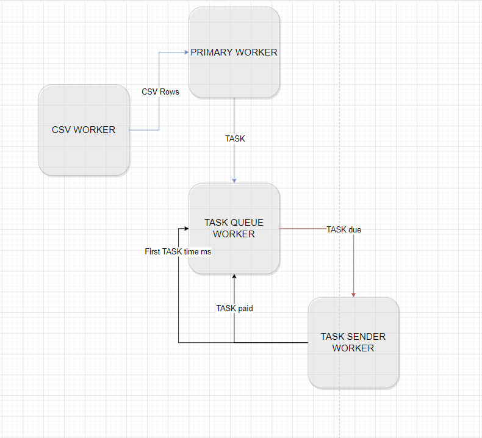

# Customer-Service

## Installing

```bash
npm install # Install the project dependencies
npm run build # Compile the project sources
```

### Unit tests

```bash
npm run test # Run all the unit tests
```

### Development mode

```bash
npm run start:dev # Start the project with development mode
```

### Production mode

```bash
npm run start # Start the project with production mode
```

## How its works

---

Service consists of 4 parts. These are `PrimaryWorker`, `CsvWorker`, `TaskQueueWorker`, `TaskSenderWorker`.

- `CsvWorker` parses the csv file.
  - Produces csv file rows as process output.
- `TaskQueueWorker` manages the task queue.
  - Its takes a task as input and places it in the queue.
  - If a scheduled task is due, it sends it as output.
- `TaskSenderWorker` handles http operations.
  - Its takes a task as input and sends a http request to commservice.
  - If the task is paid, it sends it as output.
  - If the task is the first committed task, sends the send time as output.
- `PrimaryWorker` manages the whole process.
  - If an output comes from `CsvWorker`, it creates a task.
  - Sends the created task to `TaskQueueWorker`.
  - If an output comes from `TaskQueueWorker`, it sends task to `TaskSenderWorker`.
  - If an output comes from `TaskSenderWorker`, it sends to `TaskQueueWorker`.

## Scheme

---



Note: Using "dotenv-defaults" package for parsing envitonment file.
